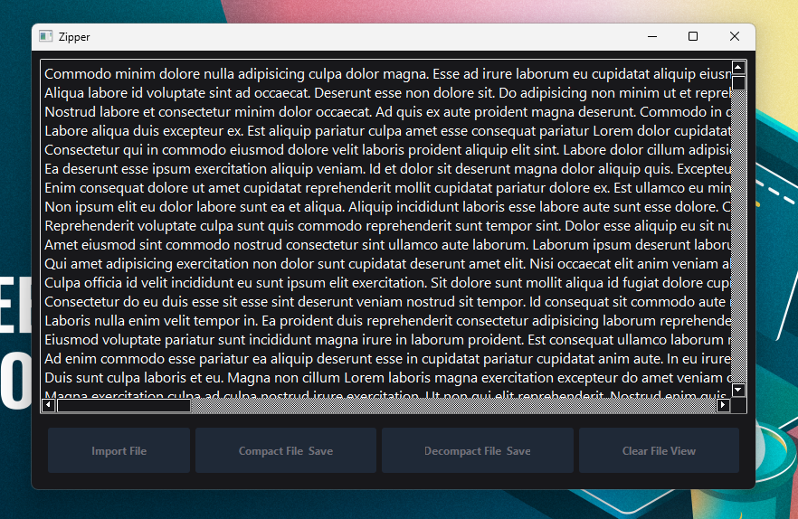

# Trabalho de Computação Gráfica
## Integrantes

|              Nome               |          Curso           | Matrícula |
|:-------------------------------:|:------------------------:|:---------:|
|       Arthur Bueno Silva        | Engenharia de Computação |   1818    |
| Pedro Augusto Barbosa Aparecido |  Engenharia de Software  |    170    |

## Como utilizar o app
Foi9 desenvolvido um aplicativo 'dedsktop', para ficar mais simples a compactação e decompactação de algum arquivo.
Para poder executá-lo, precisa apenas ter o **Python 3.11.6** instalado na máquina e seguir os seguintes passos:

#### Ter um ambiente virtual criado e ativado
```shell
> python -m venv venv
> ./venv/Scripts/Activate.ps1
```

#### Instalar as dependências
```shell
> pip install -r requirements.txt
```

#### Rodar o arquivo **main.py** dentro do ambiente virtual
```shell
> python zipper/application/main.py

# ------ OU ------

> cd ./zipper/application && python main.py
```

#### Outra alternativa
Também poderá baixar o app diretamente do **GitHub** se preferir clicando [aqui](https://github.com/pedroaba/zipper/releases/download/v1/zipperv1.0.0.zip)

### Utilização do aplicativo
O aplicativo tem quatro funções, nas quais são:

### Decompact File & Save
Nessa função você irá decompactar um arquivo ``*.marcelo`` e salvar numa pasta da sua escolha.

### Compact File & Save
Nessa você irá compactar o arquivo ``*.txt`` e salvar numa pasta da sua escolha. 

### Clear Content
Esta função irá limpar o conteúdo do ‘preview’ arquivo sem estar comprimido

### Import File
Nessa irá poder importar qualquer arquivo ``*.txt`` para poder compactar ou ``*.marcelo`` para poder descompactar.



